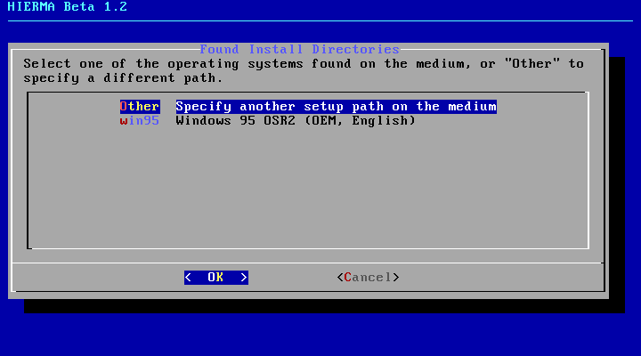
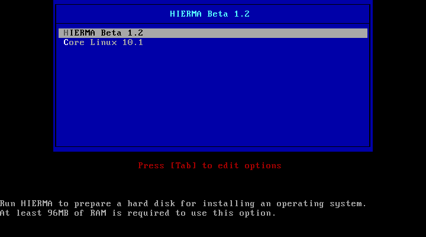
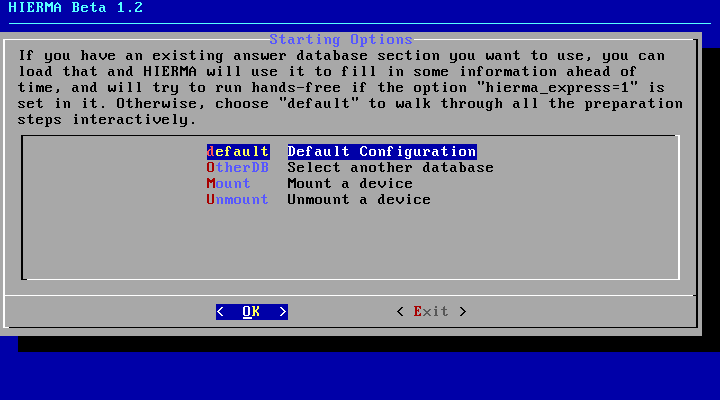
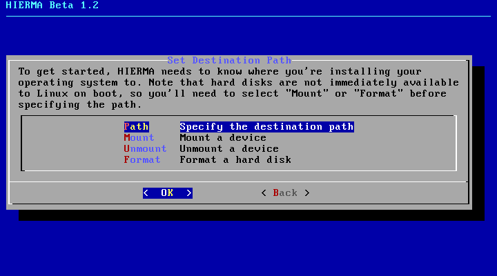
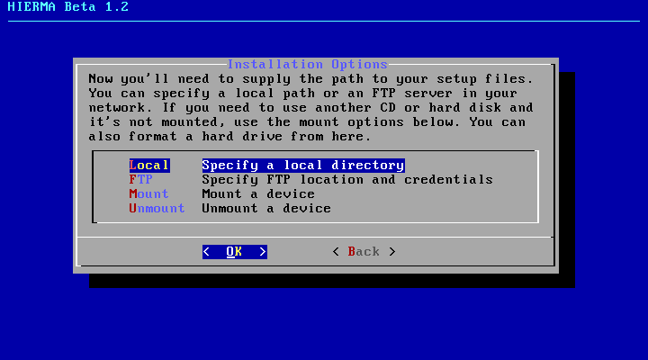
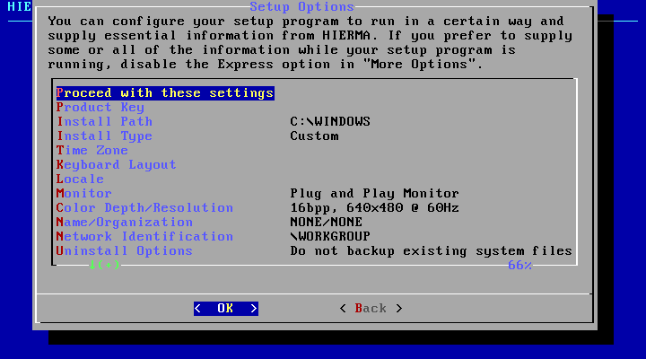
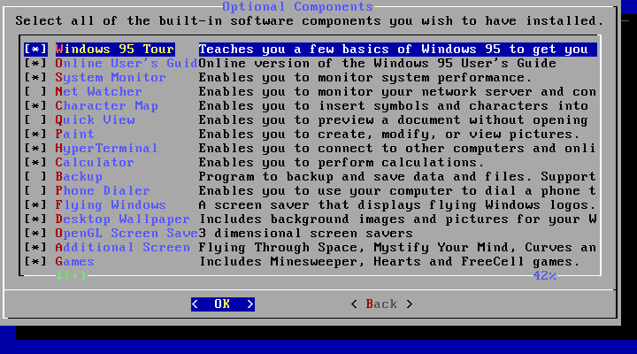
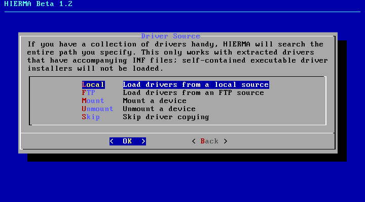
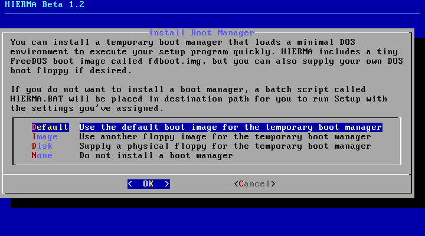

# HIERMA - an external remastering tool for Windows 9x

Created by Kugee (RazorBack95)

Retreived from https://web.archive.org/web/20231004013123/https://razorback95.com/projects/hierma.php

Abandoned, probably will not be further developed.

isosrc contains the files used to make the iso:
 - `bin`: HIERMA scripts and config files (i.e. the core logic). It also contains FreeDOS utilities as well as the tinylinux image/config
 - `doc`: changelog as well as a readme
 - `src`: source code for the FreeDOS utilities found in `bin`; no apparent modifications from original sources.

tinysrc contains the `tinylinux` source code; no apparent modifications from original sources.

It's unknown how this was built.

[Download the ISO from the releases section.](https://github.com/DiscUtilsEx/Hierma/releases)

Original readme is as follows:

## README



Hierma is an external Windows 9x remastering tool powered by Tiny Core Linux for systems with 96MB of RAM or more. It provides the convenience of specifying all necessary setup information upfront and preloading drivers so you can then leave your computer unattended as it installs everything you request. Hierma is licensed under the GNU General Public License version 2.

Due to the inflexibility resulting from using a new version of a Linux distribution that is bound to tie up too many resources for older systems, Hierma as it is today has been abandoned. I have made plans to recreate the entire project from scratch with DOS in mind, but given I've found it easier to create and distribute remasters of [Windows 95 OSR2](https://web.archive.org/web/20231004013123/https://razorback95.com/projects/win95dl/index.php) and [Windows 98 Second Edition](https://web.archive.org/web/20231004013123/https://razorback95.com/projects/redtoast/index.php) myself, the future of this project is uncertain. If there is a significant demand for exact customization of a DOS/Windows installation on the user's end, I may return to it.

An INF manipulation tool has been written in C more recently, providing a number of features for interactive prompts and also modifying .REG scripts. This is not currently being worked on as of now, but you can download the source code yourself, located on [this page.](https://drevonor.com/sardine/files/infsect.zip)

## How to Use

### 1. Booting Hierma

Insert the Hierma boot CD into any computer capable of booting from CDs. Make sure the computer has 96MB of RAM or more.

[](images/hguide/hierma_guide1.gif)

When you see the boot menu pictured above, select **HIERMA Beta 1.2**.

Wait until you reach the welcome dialog, and keep going until you reach the dialog pictured below. You can read the included GPL if you want to.

[](images/hguide/hierma_guide2.gif)

The answer database selection screen was supposed to allow users to specify their own configuration file upfront for either interactive or unattended uses of Hierma. Such a feature was never implemented, so always choose `default`.

### 2. Setting an Installation Path

[](images/hguide/hierma_guide3.gif)

From this dialog, you can either install to an existing partition or quickly format a hard disk.

#### Selecting an Existing Partition

Select `Mount`, then select the partition you wish to install to. Hard disks in Linux are denoted as `/dev/sdXY`, with `X` being the letter of the hard disk (not as it would appear in DOS), and `Y` being the partition number. The partition size should be reported in the dialog. A dialog will appear:

```
The new partition has been mounted at /mnt/hierma_dest/HIERMA, and the destination path has been set to that automatically.
```

You will then be moved to the Installation Options dialog.

#### Formatting a Hard Disk

**NOTE: This process is destructive, so make sure you have checked the contents of your hard disk for anything you need to keep.** I will not be held responsible for any data loss Hierma causes!

Select `Format`, and select a hard disk to format. Entire hard disks are denoted as `/dev/sdX`, with `X` representing the letter of the hard disk (not as it would appear in DOS.

In the following dialog, you will need to select one of three partition types listed. It may sound confusing that there are two FAT16 types, so let me explain:

**FAT16** - used by MS-DOS, Windows 95 RTM/OSR1, and very likely Windows NT 4.0 and earlier. This is practical if you need to be able to use multiple partitions from MS-DOS 6.22 or earlier, but could be unsafe in Windows 95 OSR2 and later, especially using Linux disk tools.

**FAT16 LBA** - a newer variant of FAT16 that's still limited to 2GB, but allows creating many more 2GB partitions spanning disks larger than 8GB. This should be used with Windows 95 OSR2, Windows NT 5.0, and later, and also works in Windows 95 RTM and *maybe* Windows NT 4.0. It's also why a readme file in Windows 95 OSR2 says you MUST create or use a new startup disk using MS-DOS 7.1 even if you do not plan to use FAT32.

**FAT32 LBA** - this allows the creation of partitions up to 2TB, though realistically you shouldn't go higher than 128GB in Windows 9x. This is only available in Windows 95 OSR2, Windows NT 5.0, and onward.

Confirm that you wish to format the hard disk, and you will see the following dialog:

```
The new partition has been mounted at /mnt/hierma_dest/HIERMA, and the destination path has been set to that automatically.
```

You may have noticed that formatting a hard disk is very quick in Hierma compared to the `FDISK` and `FORMAT` utilities in DOS. Following the format procedure, you will be moved to the Installation Options dialog.

### 3. Loading the Installation Source

[](images/hguide/hierma_guide4.gif)

The way Hierma works is that it copies setup files from a CD-ROM, USB disk, or FTP server to the destination drive upfront, so it can locally remaster the distribution catered to your needs.

#### Using a local device

To install from a CD-ROM or USB disk, you must first mount it by selecting `Mount`. If you will use a setup CD, you may remove the Hierma boot CD as all of its necessary contents are loaded into memory. Check the second column for context on which device is what; `/dev/srX` devices have the `CD-ROM` label.

When you have selected the device you wish to use, select `Local`. While you can specify a different mount path, it is strongly recommended you use the path Hierma has filled out for you when you mounted the device. For example, if you mounted `/dev/sr0`, you should use `/mnt/hierma_sr0`. You can just press Enter to accept the path it specifies for you.

Hierma recursively searches for potential installation paths on your disk, so if necessary, you can narrow the search by appending to the path of the device with something like `/mysetups`.

#### Using an FTP server

If you prefer to load setup files over the network, you can set up an FTP server, copy the setup files to it, and connect to it from your client. Using the up and down arrow keys to navigate the form, enter the hostname of the server you wish to connect to. Hierma will recursively search for possible installation paths on the server, so be sure to specify a path to start searching from the root directory where you will log in to.

Specify a username and password if necessary, or leave the bottom two boxes empty for an anonymous connection.

*Please note that Razorback will not be hosting Hierma-compatible FTP structures for remasters or drivers.*

### 4. Selecting an Installation Directory

[](images/hguide/hierma_guide5.gif)

Hierma searches for potential setup paths by finding instances of `PRECOPY1.CAB`, and calculates the MD5 checksum of each file to see if it is a known version of Windows 9x. You can select the path to the operating system you want to install, or you can select `Other` in the event you need to choose a different path that Hierma didn't pick up on.

If the setup path contains an unknown operating system, you must specify the closest match. This is very important as it will affect how Hierma handles driver copying, including whether it will copy security catalogs or not, and if it will list drivers exclusive to one operating system or another.

### 5. Configuring Setup Options

[](images/hguide/hierma_guide6.gif)

There are a ton of setup options you can specify ahead of time, but none are mandatory upfront. A few default options are specified for you but can be changed, including the monitor type and resolution. Some things you may want to specify are the product key, time zone, name, organization, and hostname. You may also wish to load the `Internal Updates` menu down below to cap the memory addressed by Windows to 512MB or enable UltraDMA. Tweaks are toggled using the space bar.

When you are done, move to `Proceed with these settings` and hit `OK`.

### 6. Selecting Optional Components

[](images/hguide/hierma_guide7.gif)

Using the up and down arrow keys and the space bar, you can select which optional components to install. These components are found from within the INFs in the precopy cabinets of your setup path, so this menu will adapt to pretty much any version of Windows you have, including prerelease builds. If you are using a non-English version of Windows, some characters may be rendered as square blocks, and it is possible that associated components may not even install as requested.

### 7. Preloading Drivers

[](images/hguide/hierma_guide8.gif)

You may optionally preload drivers into the setup directory so that Windows will install the ones it needs for any Plug and Play devices it finds. You can do this from a local directory or an FTP server. If you do not wish to install drivers, select `Skip`.

To copy files from a local source, you may first need to unmount a device if you must replace it with another, as is the case with using a CD-ROM. In this case, select `Unmount` and find the device to unmount, such as `/dev/sr0` for the first CD-ROM drive. Insert the storage medium containing your drivers, then choose `Mount` and select the device to mount.

Select `Local` to choose a local directory to load drivers from. Do note that Hierma searches recursively from the selected directory for INFs, so make sure you start from the directory containing your drivers to avoid loading unwanted INFs. There are a few things you can do to affect how Hierma loads a list of drivers.

For any drivers that should be kept exclusive to a particular version of Windows, you can create directories `win95`, `win95b`, `win98`, `win98se`, and `winme` inside your driver directory. These directories must come immediately after the base directory for the drivers, as anything else will be ignored.

You can also modify the `[Strings]` sections of INFs to include new strings that will only be used by Hierma. `HIERMA_DESC` is used to give a driver a description that will be printed out in the menu, and `HIERMA_OSTYPE` is used to restrict the types of operating systems a driver should be available to. For something like the S3 ViRGE driver, it may be desirable to add the line `HIERMA_OSTYPE=win95,win95b` to prevent it from being listed when installing either version of Windows 98 or Windows ME, as those operating systems already include a ViRGE driver of their own.

When you select drivers either from a local or FTP source, Hierma will gather lists of all the necessary files to copy from the INFs and proceed to copy everything. If you are using a version of Windows 98 or ME, it also copies security catalog files if they are specified in each INF.

### 8. Installing a Temporary Boot Manager

[](images/hguide/hierma_guide9.gif)

Hierma cannot execute the setup program itself. Instead, you must either have a DOS boot floppy ready upon completion of Hierma in order to use your remastered setup directory, or install a temporary boot manager based on a DOS boot floppy. It is recommended that you use the default FreeDOS boot image internal to Hierma, but you can also load one from a floppy image or physical disk if necessary. If you install a temporary boot loader, Hierma can automatically execute your setup program on the next boot.

The boot manager is powered by SYSLINUX, which loads the floppy image into RAM and boots from it. Upon booting, the boot manager is discarded by overwriting the MBR with the DOS core, and subsequently the boot files from Windows Setup. Loading a floppy image into RAM is much faster than booting a physical floppy disk.

If you will not load a temporary boot manager, choose `None`.

### 9. Running Setup At Last

When Hierma finishes, it will reboot the computer. Remember to remove all floppy disks, CD-ROM discs, and any USB storage devices to avoid interfering with the upcoming setup process. If you installed a temporary boot manager, your setup program will execute automatically with the specified settings.

If you have elected not to install a temporary boot manager, you must boot from an appropriate DOS boot floppy disk. Go to your hard drive and change the working directory to `\HIERMA`. Run `HIERMA.BAT` and follow the interactive prompts. You must overwrite the MBR from here if you formatted your hard disk under Linux, or Windows will fail to boot after the first portion of Setup completes. Whether Setup will be fully automated or partially interactive depends on the settings you specified when you configured them ahead of time in Hierma.

If all goes well, you should have a working Windows 9x installation complete with the drivers you want right out of the box.
